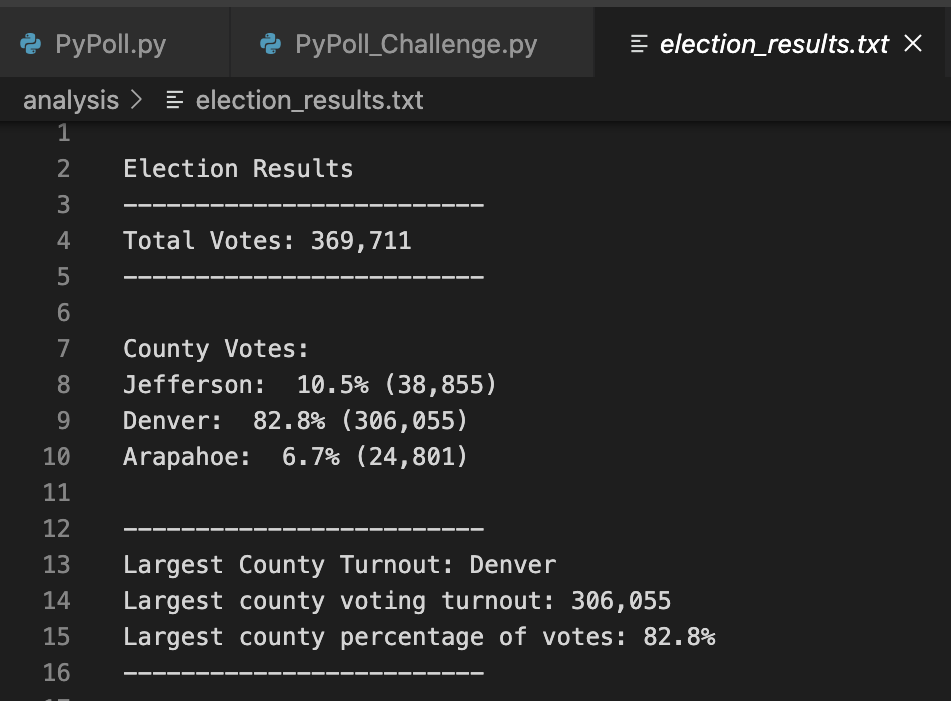
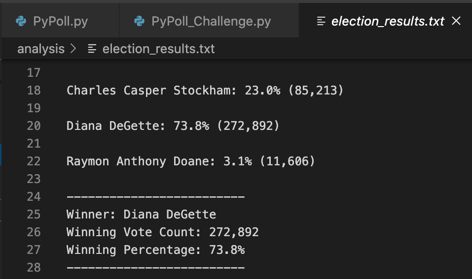

# Election_Analysis
### Project Overview ###
A Colorado Board of Elections employee has requested the following tasks to complete the election audit of a recent local congressional election. 
1. Calculate the total number of votes.
2. Get a complete list of candidates who recieved votes. 
3. calculate the total number of votes each candidate received. 
4. Calculate the percentage of votes each candidate won.
5. Determine the winner of the election based on popular vote. 

### Resources ###
- Data source: election_results.csv
- Software: Python 3.6.1, Visual Studio Code, 1.38.1

### Sumamry ###
The analysis of the election shows:
- There were a total of 369,711 votes cast.
- The candidates were:
  - Charles Casper Stockham
  - Diana DeGette
  - Raymon Anthony Doane
- The candidate results were:
  - Charles Casper Stockham receieved 23.0% of the vote and 85,213 votes.
  - Diana DeGette received 73.8% of the vote and 272,892 votes.
  - Raymon Anthony Doane received 3.1% of the vote and 11,606 votes.
- The winner of the election was: 
  - Candidate Diana DeGette, who recieved 3.1% of the vote and 11,606 votes.

### Challenge Overview ###
The purpose of the election audit was to analyze the election results as well as illustrate a clearer picture of voter turnout in the 3 counties within this congressional district. To do this, the audit determined:
- the number of votes per county
- the percentage of overall votes cast in each county
- and highlighted the county with the largest voter turnout.

### Challenge Summary ###
## Election Audit Results ##
 
- Overall votes in district: 369,711
- County turnout breakdown:
  - Jeffferson: 10.5% (38,855)
  - Denver:     82.8% (306,055)
  - Arapahoe:   06.7% (24,801)
- Largest county turnout: Denver
- Candidate vote breakdown:
  - Charles Casper Stockham:  23.0% (85,213)
  - Diana DeGette:            73.8% (272,892)
  - Rayman Anthony Doane:     03.1% (11,606)
- Election Winner by popular Vote:
  - Diana DeGette won with 73.8% of the overall vote with 272,892 votes.
## Election Audit Summary ##
The script provided for this audit analyzed the results of this congressional election quickly and accurately. Moreover, with minimal editing this script could be retooled to analyze the results of other elections in other counties. I would suggest the following guidelines for editing this script. 
- It is important to make sure that the results of the election analyzed are formatted similarly as the election_results.csv file. If for instance the candidates were listed before the county of vote, then on line 50 "candidate_name = row[2]" the referenced index of 2 should be 1 while on line 53 the index reference should be changed to 2. 
- The style of this script follows a very nice pattern. If additional information were added to the results such as party affiliation, it would be relatively straightforward to copy the syntax of this script to accomodate for a breakdown of voter results by party in addition to the analysis already provided. For example, we would add the following variables:
> party_options = []   party_votes = {}   leading_party = ""   leading_party_count = 0   leading_party_percentage = 0
